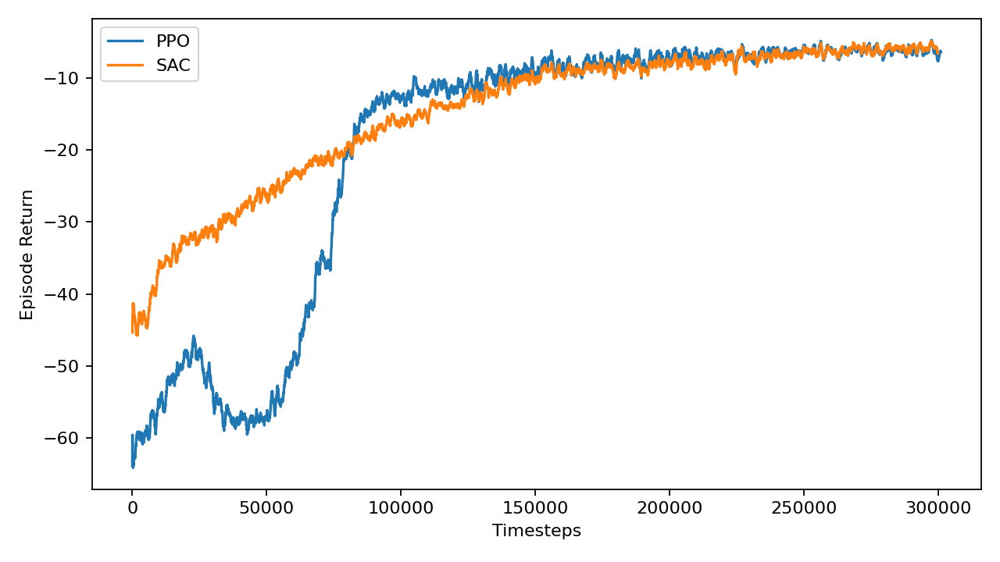
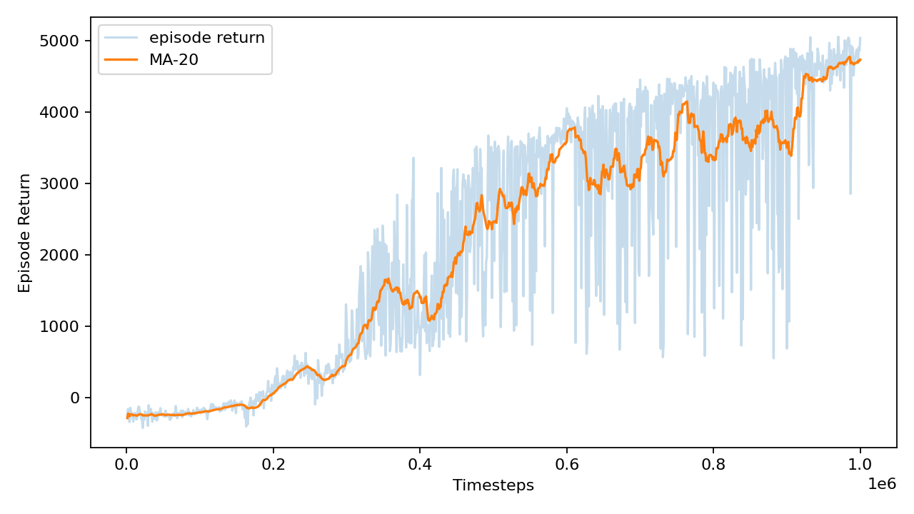

# Robot RL Simulation Baselines

Reproducible MuJoCo reinforcement learning baselines for continuous robot control tasks, including PPO/SAC training, deterministic rollout evaluation, reward-curve visualization, and video recording.

## Results

Current local run used Gymnasium `0.29.1`, which provides MuJoCo `v4` environments. Commands that pass `v5` automatically fall back to the matching `v4` environment on this machine.

| Env | Algorithm | Timesteps | Mean Return | Std Return | Notes |
| --- | ---: | ---: | ---: | ---: | --- |
| Reacher-v4 | PPO | 301,056 | -5.426 | 2.328 | robotic reaching |
| Reacher-v4 | SAC | 300,000 | -4.255 | 1.694 | off-policy comparison, fast config |
| HalfCheetah-v4 | SAC | 1,000,000 | 4547.988 | 1131.251 | locomotion demo, fast config |

### Reacher PPO vs SAC



### HalfCheetah SAC Training Curve



### Rollout Videos

- [Reacher PPO rollout](videos/Reacher-v4_ppo-episode-0.mp4)
- [Reacher SAC rollout](videos/Reacher-v4_sac-episode-0.mp4)
- [HalfCheetah SAC rollout](videos/HalfCheetah-v4_sac-episode-0.mp4)

## Project Structure

```text
robot_rl_sim_baselines/
├── scripts/
│   ├── train.py
│   ├── evaluate.py
│   ├── record_video.py
│   ├── plot_returns.py
│   ├── plot_compare.py
│   └── env_utils.py
├── results/
│   ├── summary_results.csv
│   └── training curves
├── videos/
│   └── rollout videos
├── checkpoints/
│   └── trained policies
├── requirements.txt
└── README.md
```

## Platform

Experiments were conducted on Ubuntu 22.04 with an NVIDIA RTX 4060 Ti 8GB GPU.

## Setup

```bash
conda create -n robot-rl python=3.10 -y
conda activate robot-rl
pip install -r requirements.txt
```

## Smoke Test

```bash
export MUJOCO_GL=egl
python - <<'PY'
import gymnasium as gym
env = gym.make("Reacher-v5", render_mode="rgb_array")
obs, info = env.reset()
frame = env.render()
print(type(frame), frame.shape)
env.close()
PY
```

The scripts automatically fall back to the highest installed local version. For example, Gymnasium `0.29.1` provides `Reacher-v4` instead of `Reacher-v5`.

## Train

```bash
python scripts/train.py --algo ppo --env Reacher-v5 --total-timesteps 300000 --seed 0
python scripts/train.py \
  --algo sac \
  --env Reacher-v5 \
  --total-timesteps 300000 \
  --seed 0 \
  --run-name-suffix fast \
  --train-freq 16 \
  --gradient-steps 1 \
  --learning-starts 1000

python scripts/train.py \
  --algo sac \
  --env HalfCheetah-v5 \
  --total-timesteps 1000000 \
  --seed 0 \
  --run-name-suffix fast \
  --train-freq 16 \
  --gradient-steps 1 \
  --learning-starts 1000
```

## Evaluate

```bash
python scripts/evaluate.py \
  --algo ppo \
  --env Reacher-v5 \
  --model checkpoints/Reacher-v4_ppo_seed0/final_model.zip \
  --episodes 10 \
  --output results/Reacher-v4_ppo_seed0_eval.csv
```

## Plot

```bash
python scripts/plot_returns.py results/Reacher-v4_ppo_seed0_returns.csv
python scripts/plot_compare.py \
  --input PPO=results/Reacher-v4_ppo_seed0_returns.csv SAC=results/Reacher-v4_sac_seed0_fast_returns.csv \
  --output results/Reacher-v4_ppo_vs_sac_returns.png
```

## Record Video

```bash
python scripts/record_video.py \
  --algo ppo \
  --env Reacher-v5 \
  --model checkpoints/Reacher-v4_ppo_seed0/final_model.zip \
  --episodes 3
```

## Generated Artifacts

- `checkpoints/Reacher-v4_ppo_seed0/final_model.zip`
- `results/Reacher-v4_ppo_seed0_returns.csv`
- `results/Reacher-v4_ppo_seed0_returns.png`
- `results/Reacher-v4_ppo_seed0_eval.csv`
- `videos/Reacher-v4_ppo-episode-0.mp4`
- `checkpoints/Reacher-v4_sac_seed0_fast/final_model.zip`
- `results/Reacher-v4_sac_seed0_fast_returns.csv`
- `results/Reacher-v4_sac_seed0_fast_returns.png`
- `results/Reacher-v4_sac_seed0_fast_eval.csv`
- `videos/Reacher-v4_sac-episode-0.mp4`
- `checkpoints/HalfCheetah-v4_sac_seed0_fast/final_model.zip`
- `results/HalfCheetah-v4_sac_seed0_fast_returns.csv`
- `results/HalfCheetah-v4_sac_seed0_fast_returns.png`
- `results/HalfCheetah-v4_sac_seed0_fast_eval.csv`
- `videos/HalfCheetah-v4_sac-episode-0.mp4`
- `results/summary_results.csv`
- `results/Reacher-v4_ppo_vs_sac_returns.png`

## Failure Case Notes

- `Reacher`: PPO converged to a stable reaching behavior but remained slightly worse than SAC in deterministic evaluation. Some episodes still miss the target by a small margin, which explains the negative return.
- `HalfCheetah`: SAC learned forward locomotion, but evaluation variance remains high. A few deterministic seeds still show lower returns, suggesting gait stability could improve with longer training or standard per-step SAC updates.

## Resume Bullets

- Built a reproducible robot control RL benchmark with Gymnasium MuJoCo and Stable-Baselines3, covering PPO/SAC training, checkpoint management, deterministic rollout evaluation, reward curve plotting, and video recording.
- Trained and evaluated Reacher and HalfCheetah continuous-control policies, comparing PPO vs SAC on reaching and producing a locomotion demo with SAC; final local results include Reacher SAC mean return -4.255 and HalfCheetah SAC mean return 4547.988 over 10 deterministic episodes.
- Organized experiment artifacts including training curves, evaluation CSVs, rollout videos, dependency setup, and documented commands for reproducible Ubuntu 22.04-style local runs.
